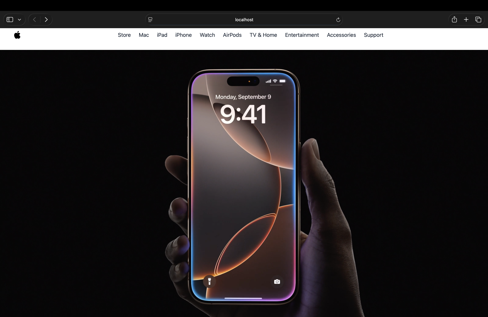

# Apple iPhone 3D Web Experience



An interactive Apple-inspired web project featuring a realistic 3D iPhone model with smooth animations and responsive design.

## Overview

This project showcases an immersive 3D iPhone experience integrated into a modern, responsive frontend. The interactive 3D model combines realistic visuals with smooth UI/UX to create an engaging web experience inspired by Apple's design language.

## Features

- **Interactive 3D iPhone Model** - Realistic, explorable 3D visualization
- **GLB Model Integration** - High-quality 3D content rendering
- **Smooth Animations** - Seamless scroll-based animations
- **Fully Responsive** - Optimized for all screen sizes
- **Apple-inspired UI/UX** - Clean, minimalist design

## Tech Stack

**3D Graphics**
- Three.js (3D rendering engine)
- GLB models (3D content)

**Frontend**
- React
- Tailwind CSS (styling)
- AOS (Animate on Scroll)

**Deployment**
- Vercel

## Key Learnings

- 3D rendering with Three.js in React applications
- GLB file handling and optimization
- Combining 3D graphics with frontend engineering
- Performance optimization for 3D web content
- Creating smooth scroll-based 3D interactions

## Setup

1. Clone the repository
```bash
git clone https://github.com/Prateet-Github/apple-iphone-3d.git
cd apple-iphone-3d
```

2. Install dependencies
```bash
npm install
```

3. Run the development server
```bash
npm run dev
```

4. Open `http://localhost:5173` in your browser

## Project Highlights

This project demonstrates the fusion of:
- Modern web development practices
- 3D graphics programming
- Responsive design principles
- Performance-optimized rendering

## License

Open source project.

---

Built with Three.js, React, and Tailwind CSS